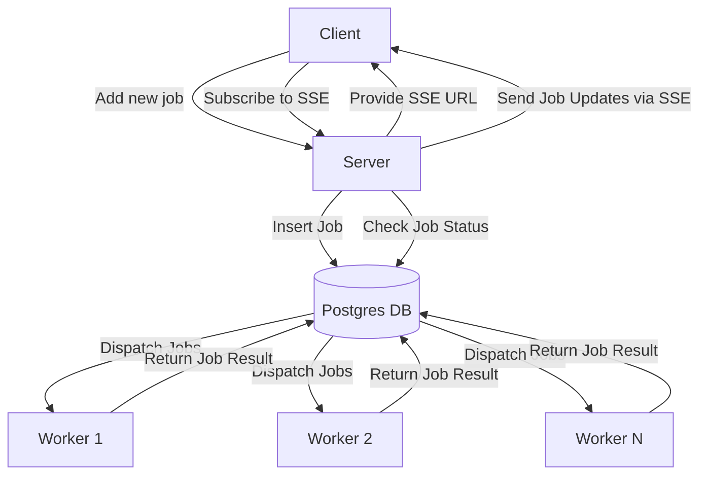

# Odin Architecture

The below diagram shows the architecture of Odin

## Diagram

```mermaid
graph TD
    A[Client] -->|Add new job| B[Server]
    B -->|Provide SSE URL| A
    A -->|Subscribe to SSE| B
    B -->|Send Job Updates via SSE| A
    B -->|Insert Job| C[(Postgres DB)]
    B -->|Check Job Status| C
    C -->|Dispatch Jobs| D[Worker 1]
    C -->|Dispatch Jobs| E[Worker 2]
    C -->|Dispatch Jobs| F[Worker N]
    D -->|Return Job Result| C
    E -->|Return Job Result| C
    F -->|Return Job Result| C
```
