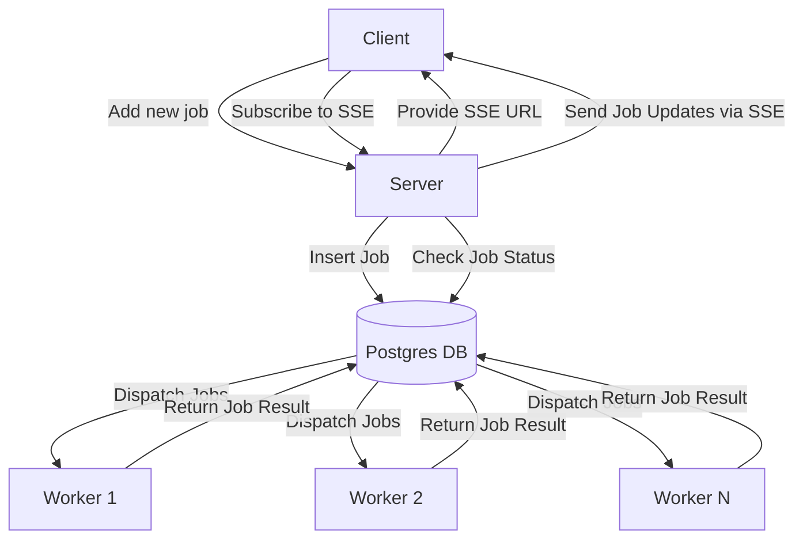

# Odin Architecture

The Odin architecture is designed to efficiently manage job submissions and updates using a client-server model with real-time communication. Below is a detailed explanation of the architecture components and their interactions.

## Diagram

## Architecture Components

### 1. Client
The client is the front-end interface where users can submit jobs for processing. It communicates with the server to add new jobs and subscribes to receive updates in real-time.

### 2. Server
The server acts as the intermediary between the client and the database. Its responsibilities include:
- **Job Submission**: Accepting job requests from clients.
- **Real-Time Communication**: Providing a Server-Sent Events (SSE) URL for clients to subscribe to job updates.
- **Database Interaction**: Inserting new jobs into the database and checking their status.

### 3. Postgres Database (DB)
The database stores all job-related information, including job status and results. It plays a crucial role in managing job dispatching:
- **Insert Job**: The server inserts new job entries into the database.
- **Check Job Status**: The server queries the database to retrieve the current status of jobs.
- **Dispatch Jobs**: The database assigns jobs to available workers for processing.

### 4. Workers
Workers are responsible for executing the jobs dispatched by the database. Each worker operates independently and returns results back to the database upon completion:
- **Job Execution**: Workers process jobs as they are dispatched.
- **Result Reporting**: Once a job is completed, workers send the results back to the database.

## Workflow Summary

1. **Job Submission**: The client submits a new job to the server.
2. **Real-Time Updates**: The server provides an SSE URL, allowing the client to subscribe for real-time updates on job status.
3. **Database Interaction**: The server inserts the job into the Postgres database and checks its status as needed.
4. **Job Dispatching**: The database dispatches jobs to available workers for execution.
5. **Result Handling**: Workers process the jobs and return results back to the database, which can then be accessed by the server and subsequently communicated back to the client.

## Conclusion

The Odin architecture effectively combines real-time communication with robust job management capabilities, ensuring that clients receive timely updates while efficiently utilizing resources through a worker-based system. This design promotes scalability and responsiveness, making it suitable for various applications requiring job processing.

